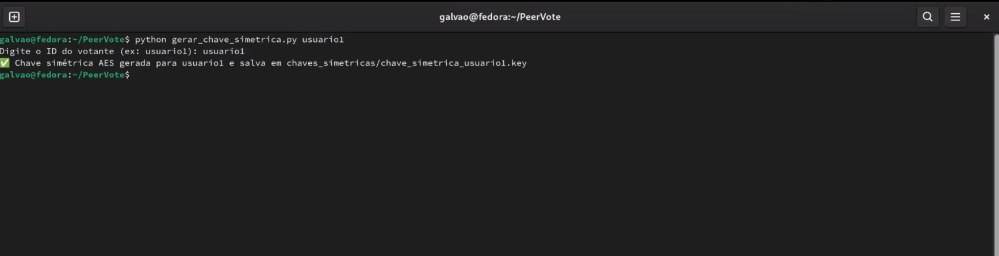
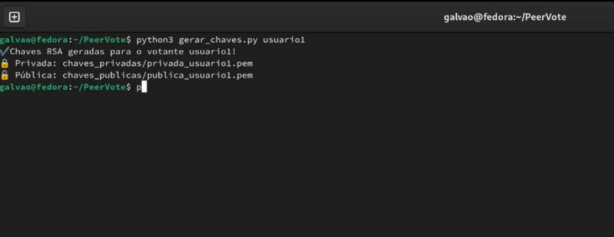
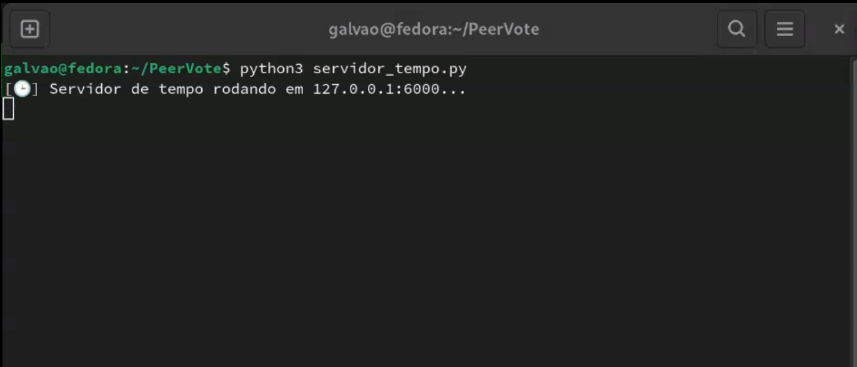
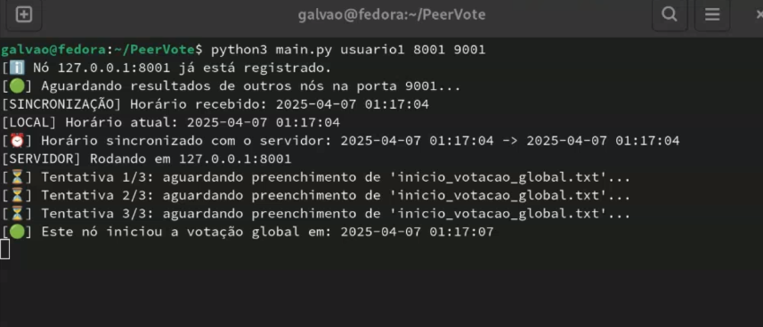
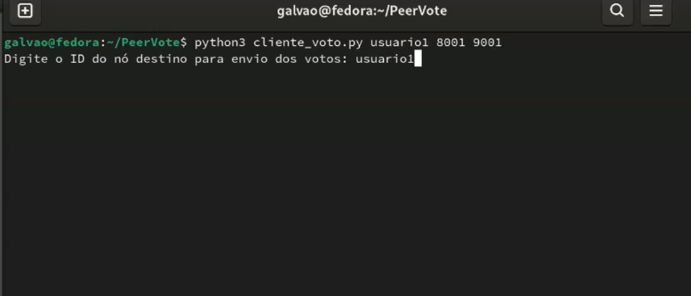
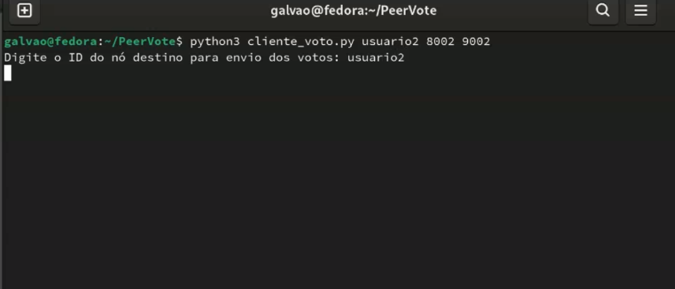
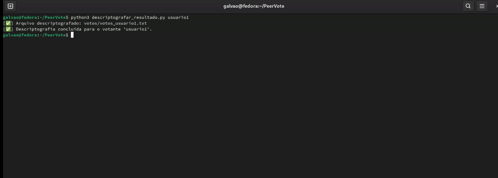

 # Peer_vote

 Projeto da disciplina de Sistemas distribuídos. 
 
 Sistema de votação P2P com segurança avançada: criptografia híbrida (RSA + AES), assinatura digital, sincronização de horário e distribuição de resultados entre nós. 

 # 🗳️ PeerVote — Sistema de Votação P2P com Criptografia e Segurança

**PeerVote** é um sistema de votação descentralizado baseado em arquitetura P2P, com ênfase em **segurança, integridade e privacidade** dos votos. Os nós trocam informações via sockets TCP e UDP, usando criptografia híbrida (RSA + AES), assinaturas digitais e sincronização de horário.

---

## 📌 Funcionalidades

✅ Arquitetura peer-to-peer (P2P) com descoberta automática de nós  
✅ Votação segura com criptografia híbrida (RSA + AES)  
✅ Assinatura digital dos votos (RSA + PSS)  
✅ Armazenamento distribuído e estruturado dos votos  
✅ Sincronização de horário entre os nós (UDP)  
✅ Contagem automática e validação dos votos  

---

## 🧠 Tecnologias e Conceitos

- **Python 3**
- **Sockets TCP/UDP**
- **Criptografia RSA & AES**
- **Assinatura Digital com PSS**
- **Codificação Base64**
- **Hash SHA-256**
- **Arquivos CSV, JSON e TXT**
- **Arquitetura descentralizada**
- **Sincronização de tempo via UDP**

---

## ⚙️ Pré-requisitos

- Python 3.8+
- Bibliotecas: `cryptography`, `tabulate`, `panda`

  # 🗳️ Passo a Passo

  ## 🧾 Passo 1 – Gerar Chaves


```bash
python gerar_chaves.py
python gerar_chave_simetrica.py
```
  ## 🧾 Passo 2 – Inicie o servidor de tempo para sincronizar todos os nós

```bash
python servidor_tejmpo.py
```

  ## 🧾 Passo 3 – Inicie o nó com o script principal

```bash
python main.py <id_do_nó> <porta_votacao> <porta_resultados>
Ex: python3 main.py usuario1 8001 9001
```
  ## 🧾 Passo 4 – Vote com o cliente


```bash
python cliente_voto.py <id_do_nó> <porta_votacao> <porta_resultados>
Ex: python3 cliente_voto.py usuario1 8001 9001
```
  ## 🧾 Passo 5 – Descriptografe o resultado recebido com seu ID


```bash
python3 descriptografar_resultado.py <id_do_nó> 
Ex: python3 descriptografar_resultado.py usuario1
```

###👨‍💻 Autoria
Desenvolvido por: Nadianne Galvão

Disciplina: Sistemas Distribuídos


🖤 Obrigada! 


